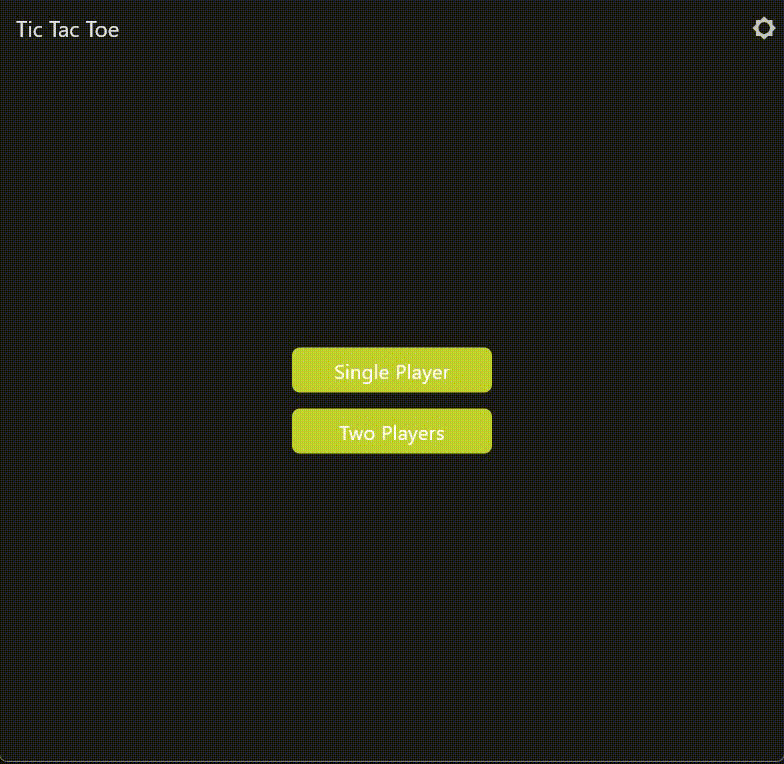

# Tic Tac Toe

This is a simple Tic Tac Toe game made with Flutter. It has 2 player and AI feature. The AI is made with the help of Minimax and Alpha-Beta pruning algorithm.

## 📱 Platforms

| Android | iOS | Web | MacOS | Linux | Windows |
| :-----: | :-: | :-: | :---: | :---: | :-----: |
|   ✔️    | ✔️  | ✔️  |  ✔️   |  ✔️   |   ✔️    |

## 📷 Screenshots



## ✨ Features

-   2 Player
-   AI (Minimax and Alpha-Beta pruning)
-   Scoreboard
-   Reset
-   Restart
-   Dark Mode

## 📦 Installation

### Prerequisites

-   Flutter
-   Android Studio / Xcode

### Setup

1. Clone the repo

```sh
git clone
```

2. Install dependencies

```sh
dart pub get
```

3. Run the app

```sh
flutter run
```

## 🤝 Contributing

Contributions, issues and feature requests are welcome!

## 📝 License

This project is licensed under the MIT License - see the [LICENSE](LICENSE) file for details

## 👨‍💻 Author

**Shokhrukhbek Yuldoshev**

-   Github: [@ShokhrukhbekYuldoshev](https://github.com/ShokhrukhbekYuldoshev)
-   Email: [@shokhrukhbekdev@gmail.com](mailto:shokhrukhbekdev@gmail.com)

## 🌟 Show your support

Give a ⭐️ if you like this project!
